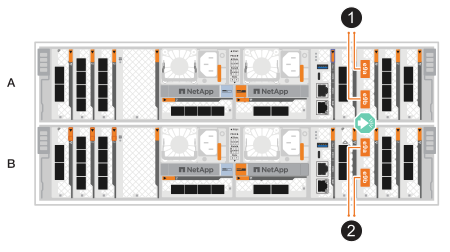
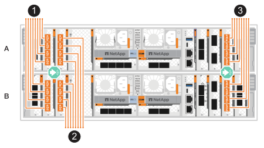

= 為 ASA A70 和 ASA A90 儲存系統連接硬體電纜
:allow-uri-read: 
:icons: font
:imagesdir: ../media/

[role="lead"]
將 ASA A70 或 ASA A90 儲存系統連接至您的網路和儲存櫃，以啟用叢集通訊、管理存取和 SAN 主機連線。此程序包括叢集 / HA 互連、管理網路、主機網路和儲存櫃連線的佈線。

.開始之前
如需將儲存系統連接至網路交換器的相關資訊，請聯絡您的網路管理員。

.關於這項工作
* 這些程序顯示一般組態。具體的佈線取決於您的儲存系統所訂購的元件。如需完整的組態和插槽優先順序詳細資料、請參閱 link:https://hwu.netapp.com["NetApp Hardware Universe"^]。
* ASA A70 和 ASA A90 上的 I/O 插槽編號為 1 至 11。
+
image::../media/drw_a1K_back_slots_labeled_ieops-2162.svg[ASA A70 和 ASA A90 控制器上的插槽編號]

* 將連接器插入連接埠時，纜線連接器拉片上的箭頭圖示會顯示正確的方向（上或下）。
+
插入連接器時、您應該會感覺到它卡入到位；如果您沒有感覺到它卡入定位、請將其移除、將其翻轉、然後再試一次。

+
image:../media/drw_cable_pull_tab_direction_ieops-1699.svg["纜線拉片方向"]

* 如果要將纜線連接至光纖交換器，請先將光纖收發器插入控制器連接埠，再將纜線連接至交換器連接埠。

[[step-1-cable-the-clusterha-connections]]
== 步驟 1 ：連接叢集 / HA 連線

連接控制器以建立 ONTAP 叢集連線。對於無交換器叢集，將控制器彼此連接。對於有交換器叢集，將控制器連接到叢集網路交換器。

NOTE: 叢集互連流量和 HA 流量共用相同的實體連接埠。

[role="tabbed-block"]
====
.無交換器叢集纜線
--
當兩個控制器直接相互連接而不使用叢集網路交換器時，請使用此佈線選項。

使用叢集 /HA 互連纜線將連接埠 e1a 連接至 e1a 、並將連接埠 e7a 連接至 e7a 。

.步驟
. 將控制器 A 上的連接埠 e1a 連接至控制器 B 上的連接埠 e1a
. 將控制器 A 上的連接埠 e7a 連接到控制器 B 上的連接埠 e7a。
+
* 叢集 / HA 互連纜線 *

+
image::../media/oie_cable_25Gb_Ethernet_SFP28_IEOPS-1069.svg[叢集 HA 纜線]

+
image::../media/drw_70-90_tnsc_cluster_cabling_ieops-1653.svg[雙節點無交換器叢集佈線圖]

--
.交換式叢集纜線
--
當控制器連接到叢集網路交換器而不是直接相互連接時，請使用此佈線選項。

使用 100 GbE 纜線將連接埠 e1a 和 e7a 連接至叢集網路交換器。

NOTE: ONTAP 9.16.1 及更新版本支援交換式叢集組態。

.步驟
. 將控制器 A 上的連接埠 e1a 和控制器 B 上的連接埠 e1a 連接至叢集網路交換器 A
. 將控制器 A 上的連接埠 e7a 和控制器 B 上的連接埠 e7a 連接至叢集網路交換器 B
+
*100 GbE 纜線 *

+
image::../media/oie_cable100_gbe_qsfp28.png[100 GbE 電纜]

+
image::../media/drw_70-90_switched_cluster_cabling_ieops-1657.svg[將叢集連線連接至叢集網路]

--
====

[[step-2-cable-the-host-network-connections]]
== 步驟 2 ：連接主機網路連線

將乙太網路模組連接埠連接到主機網路。

以下是一些典型的主機網路佈線範例。請參閱 link:https://hwu.netapp.com["NetApp Hardware Universe"^] 以瞭解您的特定系統組態。

[role="tabbed-block"]
====
.100 GbE 主機網路
--
將連接埠 e9a 和 e9b 連接至您的 100 GbE 乙太網路資料網路交換器。

NOTE: 為了最大限度地提高叢集和 HA 流量的系統效能，請勿將連接埠 e1b 和 e7b 用於主機網路連線。請使用單獨的主機卡以最大程度地提高效能。

.步驟
. 將控制器 A 連接埠 e9a 和控制器 B 連接埠 e9a 連接至乙太網路資料網路交換器。
. 將控制器 A 連接埠 e9b 和控制器 B 連接埠 e9b 連接至乙太網路資料網路交換器。
+
*100 GbE 纜線 *

+
image::../media/oie_cable_sfp_gbe_copper.svg[100 GbE 乙太網路纜線]

+

--
.10/25 GbE 主機網路
--
將每個控制器上的 10/25 GbE I/O 模組連接埠連接至主機網路交換器。

*10/25 GbE 纜線*

image::../media/oie_cable_sfp_gbe_copper.svg[10/25 GbE 纜線]

--
====

[[step-3-cable-the-management-network-connections]]
== 步驟 3 ：連接管理網路連線

將控制器連接到管理網路。

使用 1000BASE-T RJ-45 纜線，將每個控制器上的管理（扳手）連接埠連接到管理網路交換器。

.步驟
. 將控制器 A 上的管理（扳手）連接埠連接至管理網路交換器。
. 將控制器 B 上的管理（扳手）連接埠連接至管理網路交換器。
+
* 1000BASE-T RJ-45 纜線 *

+
image::../media/oie_cable_rj45.svg[RJ-45 纜線]

+
image::../media/drw_70-90_management_connection_ieops-1656.svg[連線至您的管理網路]

IMPORTANT: 請勿插入電源線。

[[step-4-cable-the-shelf-connections]]
== 步驟 4 ：連接機櫃連接線

ASA A70 和 ASA A90 儲存系統支援配備 NSM100 或 NSM100B 模組的 NS224 機架。這兩個模組的主要差異在於：

* NSM100 機架模組使用內建連接埠 e0a 和 e0b。
* NSM100B 架模組使用插槽 1 中的連接埠 e1a 和 e1b。

以下佈線範例顯示參照機架模組連接埠時 NS224 機架中的 NSM100 模組。

如需儲存系統支援的最大機櫃數量，以及所有纜線選項（例如光纖和交換器連接），請參閱link:https://hwu.netapp.com["NetApp Hardware Universe"^]。

[role="tabbed-block"]
====
.一個 NS224 儲存櫃
--
當您只有一個 NS224 機架時，請使用此佈線選項。

將每個控制器連接至 NS224 機櫃上的 NSM 模組。圖形顯示每個控制器的纜線：控制器 A 纜線以藍色顯示、控制器 B 纜線則以黃色顯示。

*100 GbE QSFP28 銅線 *

image::../media/oie_cable100_gbe_qsfp28.svg[100 GbE QSFP28 銅線]

.步驟
. 將控制器 A 連接埠 e11a 連接至 NSM A 連接埠 e0a 。
. 將控制器 A 連接埠 e11b 連接至 NSM B 連接埠 e0b。
+
image:../media/drw_a70-90_1shelf_cabling_a_ieops-1731.svg["將控制器 A e11a 和 e11b 移至單一 NS224 機櫃"]

. 將控制器 B 連接埠 e11a 連接至 NSM B 連接埠 e0A 。
. 將控制器 B 連接埠 e11b 連接至 NSM A 連接埠 e0b 。
+
image:../media/drw_a70-90_1shelf_cabling_b_ieops-1732.svg["控制器 B e11a 和 e11b 至單一 NS224 機櫃"]

--
.兩個 NS224 儲存櫃
--
當您有兩個 NS224 機架時，請使用此佈線選項。

將每個控制器連接至兩個 NS224 機櫃上的 NSM 模組。圖形顯示每個控制器的纜線：控制器 A 纜線以藍色顯示、控制器 B 纜線則以黃色顯示。

*100 GbE QSFP28 銅線 *

image::../media/oie_cable100_gbe_qsfp28.svg[100 GbE QSFP28 銅線]

.步驟
. 在控制器 A 上、連接下列連接埠：
+
.. 將連接埠 e11a 連接至機櫃 1 NSM A 連接埠 e0a 。
.. 將連接埠 e8b 連接至機櫃 1 NSM B 連接埠 e0b。
.. 將連接埠 e8a 連接至機櫃 2 NSM A 連接埠 e0a。
.. 將連接埠 e11b 連接至機櫃 2 NSM B 連接埠 e0b 。
+
image:../media/drw_a70-90_2shelf_cabling_a_ieops-1733.svg["控制器 A 的控制器與機櫃連線"]

. 在控制器 B 上、連接下列連接埠：
+
.. 將連接埠 e11a 連接至機櫃 1 NSM B 連接埠 e0A 。
.. 將連接埠 e8b 連接至機櫃 1 NSM A 連接埠 e0b。
.. 將連接埠 e8a 連接至機櫃 2 NSM B 連接埠 e0a。
.. 將連接埠 e11b 連接至機櫃 2 NSM a 連接埠 e0b 。
+
image:../media/drw_a70-90_2shelf_cabling_b_ieops-1734.svg["控制器 B 的控制器與機櫃連線"]

--
====
.接下來呢？
將儲存控制器連線至網路、然後將控制器連線至儲存櫃之後link:power-on-hardware.html["開啟 ASA R2 儲存系統電源"]、您就可以了。
