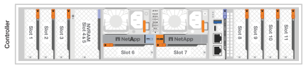

= 為 ASA R2 儲存系統連接硬體纜線
:allow-uri-read: 
:icons: font
:imagesdir: ../media/

[role="lead"]
為 ASA R2 儲存系統安裝機架硬體後、請安裝控制器的網路纜線、並將纜線連接到控制器和儲存櫃。

.開始之前
如需將儲存系統連接至網路交換器的相關資訊，請聯絡您的網路管理員。

.關於這項工作
* 這些程序顯示一般組態。具體的佈線取決於您的儲存系統所訂購的元件。如需完整的組態和插槽優先順序詳細資料、請參閱 link:https://hwu.netapp.com["NetApp Hardware Universe"^]。
* 叢集 / HA 和主機網路纜線程序顯示一般組態。
+
如果在佈線過程中沒有看到您的配置，請前往link:https://hwu.netapp.com["NetApp Hardware Universe"^]獲得全面的配置和插槽優先級信息，以便正確連接儲存系統。

* 如果您有 ASA A1K、ASA A70 或 ASA A90 儲存系統，則 I/O 插槽編號為 1 到 11。
+

* 將連接器插入連接埠時，纜線連接器拉片上的箭頭圖示會顯示正確的方向（上或下）。
+
插入連接器時、您應該會感覺到它卡入到位；如果您沒有感覺到它卡入定位、請將其移除、將其翻轉、然後再試一次。

+
image:../media/drw_cable_pull_tab_direction_ieops-1699.svg["纜線拉片方向"]

* 如果要將纜線連接至光纖交換器，請先將光纖收發器插入控制器連接埠，再將纜線連接至交換器連接埠。

== 步驟 1 ：連接叢集 / HA 連線

將控制器連接至 ONTAP 叢集。此程序會因您的儲存系統機型和 I/O 模組組組態而異。

NOTE: 叢集互連流量和 HA 流量共用相同的實體連接埠。

[role="tabbed-block"]
====
.A1K
--
建立 ONTAP 叢集連線。對於無交換器叢集，請將控制器彼此連接。對於交換式叢集，請將控制器連接至叢集網路交換器。

.無交換器叢集纜線
[%collapsible]
=====
使用叢集 /HA 互連纜線將連接埠 e1a 連接至 e1a 、並將連接埠 e7a 連接至 e7a 。

.步驟
. 將控制器 A 上的連接埠 e1a 連接至控制器 B 上的連接埠 e1a
. 將控制器 A 上的連接埠 e7a 連接至控制器 B 上的連接埠 e1a
+
* 叢集 / HA 互連纜線 *

+
image::../media/oie_cable_25Gb_Ethernet_SFP28_IEOPS-1069.svg[叢集 HA 纜線]

+
image::../media/drw_a1k_tnsc_cluster_cabling_ieops-1648.svg[雙節點無交換器叢集佈線圖]

=====
.交換式叢集纜線
[%collapsible]
=====
使用 100 GbE 纜線將連接埠 e1a 連接至 e1a ，並將連接埠 e7a 連接至 e7a 。

NOTE: 9.16.1 及更新版本均支援交換式叢集組態。

.步驟
. 將控制器 A 上的連接埠 e1a 和控制器 B 上的連接埠 e1a 連接至叢集網路交換器 A
. 將控制器 A 上的連接埠 e7a 和控制器 B 上的連接埠 e7a 連接至叢集網路交換器 B
+
*100 GbE 纜線 *

+
image::../media/oie_cable100_gbe_qsfp28.png[100 GB 纜線]

+
image::../media/drw_a1k_switched_cluster_cabling_ieops-1652.svg[將叢集連線連接至叢集網路]

=====
--
.A70 和 A90
--
建立 ONTAP 叢集連線。對於無交換器叢集，請將控制器彼此連接。對於交換式叢集，請將控制器連接至叢集網路交換器。

.無交換器叢集纜線
[%collapsible]
=====
使用叢集 /HA 互連纜線將連接埠 e1a 連接至 e1a ，並將連接埠 e7a 連接至 e7a 。

.步驟
. 將控制器 A 上的連接埠 e1a 連接至控制器 B 上的連接埠 e1a
. 將控制器 A 上的連接埠 e7a 連接至控制器 B 上的連接埠 e1a
+
* 叢集 / HA 互連纜線 *

+
image::../media/oie_cable_25Gb_Ethernet_SFP28_IEOPS-1069.svg[叢集 HA 纜線]

+
image::../media/drw_70-90_tnsc_cluster_cabling_ieops-1653.svg[雙節點無交換器叢集佈線圖]

=====
.交換式叢集纜線
[%collapsible]
=====
使用 100 GbE 纜線將連接埠 e1a 連接至 e1a ，並將連接埠 e7a 連接至 e7a 。

NOTE: 9.16.1 及更新版本均支援交換式叢集組態。

.步驟
. 將控制器 A 上的連接埠 e1a 和控制器 B 上的連接埠 e1a 連接至叢集網路交換器 A
. 將控制器 A 上的連接埠 e7a 和控制器 B 上的連接埠 e7a 連接至叢集網路交換器 B
+
*100 GbE 纜線 *

+
image::../media/oie_cable100_gbe_qsfp28.png[100 GB 纜線]

+
image::../media/drw_70-90_switched_cluster_cabling_ieops-1657.svg[將叢集連線連接至叢集網路]

=====
--
.A20、A30和A50
--
建立 ONTAP 叢集連線。對於無交換器叢集，請將控制器彼此連接。對於交換式叢集，請將控制器連接至叢集網路交換器。

[NOTE]
====
叢集/HA 佈線範例展示了常見的配置。

如果您在此處沒有看到您的配置，請前往 link:https://hwu.netapp.com["NetApp Hardware Universe"^] 取得有關儲存系統佈線的全面配置和插槽優先權資訊。

====
* 無交換器叢集佈線 *

將控制器彼此連接，以建立 ONTAP 叢集連線。

.ASA A30 和 ASA A50 ，含兩個雙埠 40/100 GbE I/O 模組
[%collapsible]
=====
.步驟
. 連接叢集 / HA 互連連：
+

NOTE: 叢集互連流量和 HA 流量共用相同的實體連接埠（位於插槽 2 和 4 的 I/O 模組上）。連接埠為 40/100 GbE 。

+
.. 將控制器 A 連接埠 E2A 連接至控制器 B 連接埠 E2A 。
.. 將控制器 A 連接埠 E4A 連接至控制器 B 連接埠 E4A 。
+

NOTE: I/O 模組連接埠 e2b 和 e4b 未使用，可供主機網路連線使用。

+
*100 GbE 叢集 / HA 互連纜線 *

+
image::../media/oie_cable100_gbe_qsfp28.png[叢集 HA 100 GbE 纜線]

+
image::../media/drw_isi_a30-50_switchless_2p_100gbe_2card_cabling_ieops-2011.svg[使用兩個 100GbE IO 模組的 A30 和 A50 無交換器叢集佈線圖]

=====
.ASA A30 和 ASA A50 ，搭配一個雙埠 40/100 GbE I/O 模組
[%collapsible]
=====
.步驟
. 連接叢集 / HA 互連連：
+

NOTE: 叢集互連流量和 HA 流量共用相同的實體連接埠（位於插槽 4 的 I/O 模組上）。連接埠為 40/100 GbE 。

+
.. 將控制器 A 連接埠 E4A 連接至控制器 B 連接埠 E4A 。
.. 將控制器 A 連接埠 e4b 連接至控制器 B 連接埠 e4b 。
+
*100 GbE 叢集 / HA 互連纜線 *

+
image::../media/oie_cable100_gbe_qsfp28.png[叢集 HA 100 GbE 纜線]

+
image::../media/drw_isi_a30-50_switchless_2p_100gbe_1card_cabling_ieops-1925.svg[使用一個 100GbE IO 模組的 A30 和 A50 無交換器叢集佈線圖]

=====
.ASA A20 搭配一個雙連接埠 10/25 GbE I/O 模組
[%collapsible]
=====
.步驟
. 連接叢集 / HA 互連連：
+

NOTE: 叢集互連流量和 HA 流量共用相同的實體連接埠（位於插槽 4 的 I/O 模組上）。連接埠為 10/25 GbE 。

+
.. 將控制器 A 連接埠 E4A 連接至控制器 B 連接埠 E4A 。
.. 將控制器 A 連接埠 e4b 連接至控制器 B 連接埠 e4b 。
+
*25 GbE 叢集 / HA 互連纜線 *

+
image:../media/oie_cable_sfp_gbe_copper.png["GbE SFP 銅線連接器，寬度 = 100px"]

+
image::../media/drw_isi_a20_switchless_2p_25gbe_cabling_ieops-2018.svg[使用一個 25 GbE IO 模組的無交換器叢集佈線圖]

=====
* 交換式叢集佈線 *

將控制器連接至叢集網路交換器，以建立 ONTAP 叢集連線。

.ASA A30 或 ASA A50 ，含兩個雙埠 40/100 GbE I/O 模組
[%collapsible]
=====
.步驟
. 連接叢集 / HA 互連連線：
+

NOTE: 叢集互連流量和 HA 流量共用相同的實體連接埠（位於插槽 2 和 4 的 I/O 模組上）。連接埠為 40/100 GbE 。

+
.. 將控制器 A 連接埠 e4a 連接到叢集網路交換器 A。
.. 將控制器 A 連接埠 e2a 連接到叢集網路交換器 B。
.. 將控制器 B 連接埠 e4a 連接到叢集網路交換器 A。
.. 將控制器 B 連接埠 e2a 連接到叢集網路交換器 B。
+

NOTE: I/O 模組連接埠 e2b 和 e4b 未使用，可供主機網路連線使用。

+
*40/100 GbE 叢集 / HA 互連纜線 *

+
image::../media/oie_cable100_gbe_qsfp28.png[叢集 HA 40/100 GbE 纜線]

+
image::../media/drw_isi_a30-50_switched_2p_100gbe_2card_cabling_ieops-2013.svg[使用兩個 100GbE IO 模組的 A30 和 A50 交換式叢集佈線圖]

=====
.ASA A30 或 ASA A50 搭配一個 2 埠 40/100 GbE I/O 模組
[%collapsible]
=====
.步驟
. 將控制器連接至叢集網路交換器：
+

NOTE: 叢集互連流量和 HA 流量共用相同的實體連接埠（位於插槽 4 的 I/O 模組上）。連接埠為 40/100 GbE 。

+
.. 將控制器 A 連接埠 e4a 連接到叢集網路交換器 A。
.. 將控制器 A 連接埠 e4b 連接到叢集網路交換器 B。
.. 將控制器 B 連接埠 e4a 連接到叢集網路交換器 A。
.. 將控制器 B 連接埠 e4b 連接到叢集網路交換器 B。
+
*40/100 GbE 叢集 / HA 互連纜線 *

+
image::../media/oie_cable100_gbe_qsfp28.png[叢集 HA 40/100 GbE 纜線]

+
image::../media/drw_isi_a30-50_2p_100gbe_1card_switched_cabling_ieops-1926.svg[將叢集連線連接至叢集網路]

=====
.ASA A20 搭配一個雙連接埠 10/25 GbE I/O 模組
[%collapsible]
=====
. 將控制器連接至叢集網路交換器：
+

NOTE: 叢集互連流量和 HA 流量共用相同的實體連接埠（位於插槽 4 的 I/O 模組上）。連接埠為 10/25 GbE 。

+
.. 將控制器 A 連接埠 e4a 連接到叢集網路交換器 A。
.. 將控制器 A 連接埠 e4b 連接到叢集網路交換器 B。
.. 將控制器 B 連接埠 e4a 連接到叢集網路交換器 A。
.. 將控制器 B 連接埠 e4b 連接到叢集網路交換器 B。
+
*10/25 GbE 叢集 / HA 互連纜線 *

+
image::../media/oie_cable_sfp_gbe_copper.png[GbE SFP 銅線連接器]

+
image::../media/drw_isi_a20_switched_2p_25gbe_cabling_ieops-2019.svg[使用一個 25GbE IO 模組的 A20 交換式叢集佈線圖]

=====
--
.C30
--
建立 ONTAP 叢集連線。對於無交換器叢集，請將控制器彼此連接。對於交換式叢集，請將控制器連接至叢集網路交換器。

[NOTE]
====
叢集/HA 佈線範例展示了常見的配置。

如果您在此處沒有看到您的配置，請前往 link:https://hwu.netapp.com["NetApp Hardware Universe"^] 取得有關儲存系統佈線的全面配置和插槽優先權資訊。

====
* 無交換器叢集佈線 *

將控制器彼此連接，以建立 ONTAP 叢集連線。

.配備兩個 2 連接埠 40/100 GbE I/O 模組的 ASA C30
[%collapsible]
=====
.步驟
. 連接叢集 / HA 互連連線：
+

NOTE: 叢集互連流量和 HA 流量共用相同的實體連接埠（位於插槽 2 和 4 的 I/O 模組上）。連接埠為 40/100 GbE 。

+
.. 將控制器 A 連接埠 E2A 連接至控制器 B 連接埠 E2A 。
.. 將控制器 A 連接埠 E4A 連接至控制器 B 連接埠 E4A 。
+

NOTE: I/O 模組連接埠 e2b 和 e4b 未使用，可供主機網路連線使用。

+
*100 GbE 叢集 / HA 互連纜線 *

+
image::../media/oie_cable100_gbe_qsfp28.png[叢集 HA 100 GbE 纜線]

+
image::../media/drw_isi_a30-50_switchless_2p_100gbe_2card_cabling_ieops-2011.svg[使用兩個 100GbE IO 模組的 A30 和 A50 無交換器叢集佈線圖]

=====
.ASA C30 搭配一個雙連接埠 40/100 GbE I/O 模組
[%collapsible]
=====
.步驟
. 連接叢集 / HA 互連連線：
+

NOTE: 叢集互連流量和 HA 流量共用相同的實體連接埠（位於插槽 4 的 I/O 模組上）。連接埠為 40/100 GbE 。

+
.. 將控制器 A 連接埠 E4A 連接至控制器 B 連接埠 E4A 。
.. 將控制器 A 連接埠 e4b 連接至控制器 B 連接埠 e4b 。
+
*100 GbE 叢集 / HA 互連纜線 *

+
image::../media/oie_cable100_gbe_qsfp28.png[叢集 HA 100 GbE 纜線]

+
image::../media/drw_isi_a30-50_switchless_2p_100gbe_1card_cabling_ieops-1925.svg[使用 100GBE I/O 模組的 C30 無交換器叢集佈線圖]

=====
* 交換式叢集佈線 *

將控制器連接至叢集網路交換器，以建立 ONTAP 叢集連線。

.配備兩個 2 連接埠 40/100 GbE I/O 模組的 ASA C30
[%collapsible]
=====
.步驟
. 連接叢集 / HA 互連連線：
+

NOTE: 叢集互連流量和 HA 流量共用相同的實體連接埠（位於插槽 2 和 4 的 I/O 模組上）。連接埠為 40/100 GbE 。

+
.. 將控制器 A 連接埠 e4a 連接到叢集網路交換器 A。
.. 將控制器 A 連接埠 e2a 連接到叢集網路交換器 B。
.. 將控制器 B 連接埠 e4a 連接到叢集網路交換器 A。
.. 將控制器 B 連接埠 e2a 連接到叢集網路交換器 B。
+

NOTE: I/O 模組連接埠 e2b 和 e4b 未使用，可供主機網路連線使用。

+
*40/100 GbE 叢集 / HA 互連纜線 *

+
image::../media/oie_cable100_gbe_qsfp28.png[叢集 HA 40/100 GbE 纜線]

+
image::../media/drw_isi_a30-50_switched_2p_100gbe_2card_cabling_ieops-2013.svg[使用兩個 100gbe io 模組的 c30 交換集群佈線圖]

=====
.ASA C30 搭配一個雙連接埠 40/100 GbE I/O 模組
[%collapsible]
=====
.步驟
. 將控制器連接到叢集網路交換器：
+

NOTE: 叢集互連流量和 HA 流量共用相同的實體連接埠（位於插槽 4 的 I/O 模組上）。連接埠為 40/100 GbE 。

+
.. 將控制器 A 連接埠 e4a 連接到叢集網路交換器 A。
.. 將控制器 A 連接埠 e4b 連接到叢集網路交換器 B。
.. 將控制器 B 連接埠 e4a 連接到叢集網路交換器 A。
.. 將控制器 B 連接埠 e4b 連接到叢集網路交換器 B。
+
*40/100 GbE 叢集 / HA 互連纜線 *

+
image::../media/oie_cable100_gbe_qsfp28.png[叢集 HA 40/100 GbE 纜線]

+
image::../media/drw_isi_a30-50_2p_100gbe_1card_switched_cabling_ieops-1926.svg[將叢集連線連接至叢集網路]

=====
--
====

== 步驟 2 ：連接主機網路連線

將控制器連接到主機網路。

此程序會因您的儲存系統機型和 I/O 模組組組態而異。

[role="tabbed-block"]
====
.A1K
--
將乙太網路模組連接埠連接到主機網路。

以下是一些典型的主機網路纜線範例。如需特定系統組態的詳細資訊、請參閱 link:https://hwu.netapp.com["NetApp Hardware Universe"^] 。

.步驟
. 將連接埠 e9a 和 e9b 連接至乙太網路資料網路交換器。
+

NOTE: 為了讓叢集和 HA 流量發揮最大的系統效能、請勿使用連接埠 e1b 和 e7b 連接埠進行主機網路連線。請使用獨立的主機卡來發揮最大效能。

+
*100 GbE 纜線 *

+

+
image::../media/drw_a1k_network_cabling1_ieops-1649.svg[連接至 100Gb 乙太網路的纜線]

. 連接 10/25 GbE 主機網路交換器。
+
*10/25 GbE 主機 *

+

+
image::../media/drw_a1k_network_cabling2_ieops-1650.svg[連接到 10/25Gb 乙太網路的纜線]

--
.A70 和 A90
--
將乙太網路模組連接埠連接到主機網路。

以下是一些典型的主機網路纜線範例。如需特定系統組態的詳細資訊、請參閱 link:https://hwu.netapp.com["NetApp Hardware Universe"^] 。

.步驟
. 將連接埠 e9a 和 e9b 連接至乙太網路資料網路交換器。
+

NOTE: 為了讓叢集和 HA 流量發揮最大的系統效能、請勿使用連接埠 e1b 和 e7b 連接埠進行主機網路連線。請使用獨立的主機卡來發揮最大效能。

+
*100 GbE 纜線 *

+

+
image::../media/drw_70-90_network_cabling1_ieops-1654.svg[連接至 100 Gb 乙太網路的纜線]

. 連接 10/25 GbE 主機網路交換器。
+
*4 個連接埠、 10/25 GbE 主機 *

+

+
image::../media/drw_70-90_network_cabling2_ieops-1655.svg[連接至 100Gb 乙太網路的纜線]

--
.A20、A30和A50
--
將乙太網路模組連接埠或光纖通道（ FC ）模組連接埠連接至主機網路。

[NOTE]
====
主機網路佈線範例展示了常見的配置。

如果您在此處沒有看到您的配置，請前往 link:https://hwu.netapp.com["NetApp Hardware Universe"^] 取得有關儲存系統佈線的全面配置和插槽優先權資訊。

====
* 乙太網路主機纜線 *

.ASA A30 和 ASA A50 ，含兩個雙埠 40/100 GbE I/O 模組
[%collapsible]
=====
在每個控制器上，將連接埠 e2b 和 e4b 連接至乙太網路主機網路交換器。

NOTE: 插槽 2 和插槽 4 中 I/O 模組的連接埠為 40/100 GbE （主機連線為 40/100 GbE ）。

*40/100 GbE 纜線 *

image::../media/oie_cable_sfp_gbe_copper.png[40/100 GB 纜線]

image::../media/drw_isi_a30-50_host_2p_40-100gbe_2card_cabling_ieops-2014.svg[連接至 40/100GbE 乙太網路主機網路交換器的纜線]

=====
.帶有一個 4 埠 10/25 GbE I/O 模組的 ASA A20、A30 和 A50
[%collapsible]
=====
在每個控制器上，將連接埠 E2A ， e2b ， e2c 和 e2d 連接至乙太網路主機網路交換器。

*10/25 GbE 纜線 *

image:../media/oie_cable_sfp_gbe_copper.png["GbE SFP 銅線連接器，寬度 = 100px"]

image::../media/drw_isi_a30-50_host_2p_40-100gbe_1card_cabling_ieops-1923.svg[連接至 40/100GbE 乙太網路主機網路交換器的纜線]

=====
* FC 主機纜線 *

.配備 4 埠 64 Gb/s FC I/O 模組的 ASA A20、A30 和 A50
[%collapsible]
=====
在每個控制器上，將連接埠 1a ， 1b ， 1c 和 1D 連接至 FC 主機網路交換器。

* 64 Gb/s FC 纜線 *

image:../media/oie_cable_sfp_gbe_copper.png["64 GB 光纖通道纜線，寬度 = 100px"]

image::../media/drw_isi_a30-50_4p_64gb_fc_1card_cabling_ieops-1924.svg[連接至 64GB 光纖信道主機網路交換器的纜線]

=====
--
.C30
--
將乙太網路模組連接埠或光纖通道（ FC ）模組連接埠連接至主機網路。

[NOTE]
====
主機網路佈線範例展示了常見的配置。

如果您在此處沒有看到您的配置，請前往 link:https://hwu.netapp.com["NetApp Hardware Universe"^] 取得有關儲存系統佈線的全面配置和插槽優先權資訊。

====
* 乙太網路主機纜線 *

.配備兩個 2 連接埠 40/100 GbE I/O 模組的 ASA C30
[%collapsible]
=====
.步驟
. 在每個控制器上，使用纜線連接埠 e2b 和 e4b 連接乙太網路主機網路交換器。
+

NOTE: 插槽 2 和插槽 4 中 I/O 模組的連接埠為 40/100 GbE （主機連線為 40/100 GbE ）。

+
*40/100 GbE 纜線 *

+
image::../media/oie_cable_sfp_gbe_copper.png[40/100 GB 纜線]

+
image::../media/drw_isi_a30-50_host_2p_40-100gbe_2card_cabling_ieops-2014.svg[連接至 40/100GbE 乙太網路主機網路交換器的纜線]

=====
.具有 1 個 4 連接埠 10/25 GbE I/O 模組的 ASA C30
[%collapsible]
=====
.步驟
. 在每個控制器上，將連接埠 E2A ， e2b ， e2c 和 e2d 連接至乙太網路主機網路交換器。
+
*10/25 GbE 纜線 *

+
image:../media/oie_cable_sfp_gbe_copper.png["GbE SFP 銅線連接器，寬度 = 100px"]

+
image::../media/drw_isi_a30-50_host_2p_40-100gbe_1card_cabling_ieops-1923.svg[連接至 40/100GbE 乙太網路主機網路交換器的纜線]

=====
.配備 4 埠 64 Gb/s FC I/O 模組的 ASA C30
[%collapsible]
=====
.步驟
. 在每個控制器上，將連接埠 1a ， 1b ， 1c 和 1D 連接至 FC 主機網路交換器。
+
* 64 Gb/s FC 纜線 *

+
image:../media/oie_cable_sfp_gbe_copper.png["64 GB 光纖通道纜線，寬度 = 100px"]

+
image::../media/drw_isi_a30-50_4p_64gb_fc_1card_cabling_ieops-1924.svg[連接至 64GB 光纖信道主機網路交換器的纜線]

=====
--
====

== 步驟 3 ：連接管理網路連線

將控制器連接到管理網路。

如需將儲存系統連線至管理網路交換器的相關資訊，請聯絡您的網路管理員。

[role="tabbed-block"]
====
.A1K
--
使用 1000BASE-T RJ-45 纜線，將每個控制器上的管理（扳手）連接埠連接到管理網路交換器。

image::../media/oie_cable_rj45.svg[RJ-45 纜線]

* 1000BASE-T RJ-45 纜線 *

image::../media/drw_a1k_management_connection_ieops-1651.svg[連線至您的管理網路]

IMPORTANT: 請勿插入電源線。

--
.A70 和 A90
--
使用 1000BASE-T RJ-45 纜線，將每個控制器上的管理（扳手）連接埠連接到管理網路交換器。

image::../media/oie_cable_rj45.svg[RJ45 纜線]

* 1000BASE-T RJ-45 纜線 *

image::../media/drw_70-90_management_connection_ieops-1656.svg[連線至您的管理網路]

IMPORTANT: 請勿插入電源線。

--
.A20、A30和A50
--
將每個控制器上的管理（扳手）連接埠連接到管理網路交換器。

* 1000BASE-T RJ-45 纜線 *

image::../media/oie_cable_rj45.png[RJ-45 纜線]

image::../media/drw_isi_g_wrench_cabling_ieops-1928.svg[連線至您的管理網路]

IMPORTANT: 請勿插入電源線。

--
.C30
--
將每個控制器上的管理（扳手）連接埠連接到管理網路交換器。

* 1000BASE-T RJ-45 纜線 *

image::../media/oie_cable_rj45.png[RJ-45 纜線]

image::../media/drw_isi_g_wrench_cabling_ieops-1928.svg[連線至您的管理網路]

IMPORTANT: 請勿插入電源線。

--
====

== 步驟 4 ：連接機櫃連接線

以下佈線程序說明如何將控制器連接至儲存櫃。

如需儲存系統支援的最大機櫃數量，以及所有纜線選項（例如光纖和交換器連接），請參閱link:https://hwu.netapp.com["NetApp Hardware Universe"^]。

[role="tabbed-block"]
====
.A1K
--
AFF A1K 儲存系統支援具有 NSM100 或 NSM100B 模組的 NS224 架。模組之間的主要區別是：

* NSM100 機架模組使用內建連接埠 e0a 和 e0b。
* NSM100B 架模組使用插槽 1 中的連接埠 e1a 和 e1b。

以下佈線範例顯示了 NS224 機架中的 NSM100 模組（涉及機架模組連接埠）。

請選擇符合您設定的下列其中一個纜線選項。

.選項 1 ：一個 NS224 儲存櫃
[%collapsible]
=====
將每個控制器連接至 NS224 機櫃上的 NSM 模組。圖形顯示每個控制器的纜線：控制器 A 纜線以藍色顯示、控制器 B 纜線則以黃色顯示。

.步驟
. 在控制器 A 上、連接下列連接埠：
+
.. 將連接埠 e11a 連接至 NSM A 連接埠 e0a 。
.. 將連接埠 e11b 連接至連接埠 NSM B 連接埠 e0b 。
+
image:../media/drw_a1k_1shelf_cabling_a_ieops-1703.svg["將控制器 A e11a 和 e11b 移至單一 NS224 機櫃"]

. 在控制器 B 上、連接下列連接埠：
+
.. 將連接埠 e11a 連接至 NSM B 連接埠 e0A 。
.. 將連接埠 e11b 連接至 NSM a 連接埠 e0b 。
+
image:../media/drw_a1k_1shelf_cabling_b_ieops-1704.svg["將控制器 B 連接埠 e11a 和 e11b 連接到單一 NS224 架"]

=====
.選項 2 ：兩個 NS224 儲存櫃
[%collapsible]
=====
將每個控制器連接至兩個 NS224 機櫃上的 NSM 模組。圖形顯示每個控制器的纜線：控制器 A 纜線以藍色顯示、控制器 B 纜線則以黃色顯示。

.步驟
. 在控制器 A 上、連接下列連接埠：
+
.. 將連接埠 e11a 連接至機櫃 1 NSM A 連接埠 e0a 。
.. 將連接埠 e11b 連接至機櫃 2 NSM B 連接埠 e0b 。
.. 將連接埠 E10A 連接至機櫃 2 NSM A 連接埠 e0a 。
.. 將連接埠 e10b 連接至機櫃 1 NSM a 連接埠 e0b 。
+
image:../media/drw_a1k_2shelf_cabling_a_ieops-1705.svg["控制器 A 的控制器與機櫃連線"]

. 在控制器 B 上、連接下列連接埠：
+
.. 將連接埠 e11a 連接至機櫃 1 NSM B 連接埠 e0A 。
.. 將連接埠 e11b 連接至機櫃 2 NSM a 連接埠 e0b 。
.. 將連接埠 E10A 連接至機櫃 2 NSM B 連接埠 e0A 。
.. 將連接埠 e10b 連接至機櫃 1 NSM a 連接埠 e0b 。
+
image:../media/drw_a1k_2shelf_cabling_b_ieops-1706.svg["控制器 B 的控制器與機櫃連線"]

=====
--
.A70 和 A90
--
AFF A70 和 90 儲存系統支援具有 NSM100 或 NSM100B 模組的 NS224 架。模組之間的主要區別是：

* NSM100 機架模組使用內建連接埠 e0a 和 e0b。
* NSM100B 架模組使用插槽 1 中的連接埠 e1a 和 e1b。

以下佈線範例顯示了 NS224 機架中的 NSM100 模組（涉及機架模組連接埠）。

請選擇符合您設定的下列其中一個纜線選項。

.選項 1 ：一個 NS224 儲存櫃
[%collapsible]
=====
將每個控制器連接至 NS224 機櫃上的 NSM 模組。圖形顯示每個控制器的纜線：控制器 A 纜線以藍色顯示、控制器 B 纜線則以黃色顯示。

*100 GbE QSFP28 銅線 *

.步驟
. 將控制器 A 連接埠 e11a 連接至 NSM A 連接埠 e0a 。
. 將控制器 A 連接埠 e11b 連接至連接埠 NSM B 連接埠 e0b 。
+
image:../media/drw_a70-90_1shelf_cabling_a_ieops-1731.svg["將控制器 A e11a 和 e11b 移至單一 NS224 機櫃"]

. 將控制器 B 連接埠 e11a 連接至 NSM B 連接埠 e0A 。
. 將控制器 B 連接埠 e11b 連接至 NSM A 連接埠 e0b 。
+
image:../media/drw_a70-90_1shelf_cabling_b_ieops-1732.svg["控制器 B e11a 和 e11b 至單一 NS224 機櫃"]

=====
.選項 2 ：兩個 NS224 儲存櫃
[%collapsible]
=====
將每個控制器連接至兩個 NS224 機櫃上的 NSM 模組。圖形顯示每個控制器的纜線：控制器 A 纜線以藍色顯示、控制器 B 纜線則以黃色顯示。

*100 GbE QSFP28 銅線 *

.步驟
. 在控制器 A 上、連接下列連接埠：
+
.. 將連接埠 e11a 連接至機櫃 1 、 NSM A 連接埠 e0a 。
.. 將連接埠 e11b 連接至機櫃 2 、 NSM B 連接埠 e0b 。
.. 將連接埠 e8a 連接至機櫃 2 、 NSM A 連接埠 e0a 。
.. 將連接埠 e8b 連接至機櫃 1 、 NSM B 連接埠 e0b 。
+
image:../media/drw_a70-90_2shelf_cabling_a_ieops-1733.svg["控制器 A 的控制器與機櫃連線"]

. 在控制器 B 上、連接下列連接埠：
+
.. 將連接埠 e11a 連接至機櫃 1 、 NSM B 連接埠 e0A 。
.. 將連接埠 e11b 連接至機櫃 2 、 NSM A 連接埠 e0b 。
.. 將連接埠 e8a 連接至機櫃 2 、 NSM B 連接埠 e0a 。
.. 將連接埠 e8b 連接至機櫃 1 、 NSM A 連接埠 e0b 。
+
image:../media/drw_a70-90_2shelf_cabling_b_ieops-1734.svg["控制器 B 的控制器與機櫃連線"]

=====
--
.A20、A30和A50
--
NS224 架佈線程式顯示 NSM100B 模組而非 NSM100 模組。無論使用哪種類型的 NSM 模組，佈線都是相同的，只有連接埠名稱不同：

* NSM100B 模組使用插槽 1 中 I/O 模組上的連接埠 e1a 和 e1b。
* NSM100 模組使用內建（板載）連接埠 e0a 和 e0b。

使用儲存系統隨附的儲存電纜將每個控制器連接到 NS224 架上的每個 NSM 模組，儲存電纜可以是以下電纜類型：

*100 GbE QSFP28 銅線 *

image::../media/oie_cable100_gbe_qsfp28.png[100 GbE QSFP28 銅線]

圖形顯示控制器 A 的藍色纜線和控制器 B 的黃色纜線。

.步驟
. 將控制器 A 連接至機櫃：
+
.. 將控制器 A 連接埠 e3a 連接至 NSM A 連接埠 e1a 。
.. 將控制器 A 連接埠 e3b 連接至 NSM B 連接埠 e1b 。
+
image:../media/drw_isi_g_1_ns224_controller_a_cabling_ieops-1945.svg["控制器 A 連接埠 e3a 和 e3b 連接至一個 NS224 機櫃"]

. 將控制器 B 連接至機櫃：
+
.. 將控制器 B 連接埠 e3a 連接至 NSM B 連接埠 e1a 。
.. 將控制器 B 連接埠 e3b 連接至 NSM A 連接埠 e1b 。
+
image:../media/drw_isi_g_1_ns224_controller_b_cabling_ieops-1946.svg["控制器 B 連接埠 e3a 和 e3b 連接至一個 NS224 機櫃"]

--
.C30
--
NS224 架佈線程式顯示 NSM100B 模組而非 NSM100 模組。無論使用哪種類型的 NSM 模組，佈線都是相同的，只有連接埠名稱不同：

* NSM100B 模組使用插槽 1 中 I/O 模組上的連接埠 e1a 和 e1b。
* NSM100 模組使用內建（板載）連接埠 e0a 和 e0b。

使用儲存系統隨附的儲存電纜將每個控制器連接到 NS224 架上的每個 NSM 模組，儲存電纜可以是以下電纜類型：

*100 GbE QSFP28 銅線 *

image::../media/oie_cable100_gbe_qsfp28.png[100 GbE QSFP28 銅線]

圖形顯示控制器 A 的藍色纜線和控制器 B 的黃色纜線。

.步驟
. 將控制器 A 連接至機櫃：
+
.. 將控制器 A 連接埠 e3a 連接至 NSM A 連接埠 e1a 。
.. 將控制器 A 連接埠 e3b 連接至 NSM B 連接埠 e1b 。
+
image:../media/drw_isi_g_1_ns224_controller_a_cabling_ieops-1945.svg["控制器 A 連接埠 e3a 和 e3b 連接至一個 NS224 機櫃"]

. 將控制器 B 連接至機櫃：
+
.. 將控制器 B 連接埠 e3a 連接至 NSM B 連接埠 e1a 。
.. 將控制器 B 連接埠 e3b 連接至 NSM A 連接埠 e1b 。
+
image:../media/drw_isi_g_1_ns224_controller_b_cabling_ieops-1946.svg["控制器 B 連接埠 e3a 和 e3b 連接至一個 NS224 機櫃"]

--
====
.接下來呢？
將儲存控制器連線至網路、然後將控制器連線至儲存櫃之後link:power-on-hardware.html["開啟 ASA R2 儲存系統電源"]、您就可以了。
