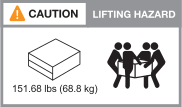
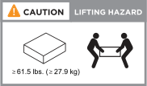

= ASA R2 儲存系統的安裝需求
:allow-uri-read: 
:icons: font
:imagesdir: ../media/

[role="lead"]
檢閱 ASA R2 儲存系統和儲存櫃所需的設備和起重預防措施。

== 安裝所需的設備

若要安裝 ASA R2 儲存系統、您需要下列設備和工具。

* 存取網頁瀏覽器以設定儲存系統
* 靜電釋放（ ESD ）固定帶
* 手電筒
* 具備 USB/ 序列連線的筆記型電腦或主控台
* 迴紋針或窄尖圓珠筆，用於設定儲存櫃 ID
* 2號十字螺絲起子

== 起重預防措施

ASA R2 儲存系統和儲存櫃非常繁重。抬起和移動這些項目時請務必謹慎。

=== 儲存系統重量

移動或抬起 ASA R2 儲存系統時、請採取必要的預防措施。

[role="tabbed-block"]
====
.A1K
--
ASA A1K 儲存系統的重量可達 62.83 磅（ 28.5 公斤）。若要抬起儲存系統，請使用兩個人或液壓舉升設備。

image::../media/drw_a1k_weight_caution_ieops-1698.svg[ASA A1K 提升注意事項圖示]

--
.A70 和 A90
--
ASA A70 或 ASA A90 儲存系統最重可達 151.68 磅（ 68.8 公斤）。若要抬起儲存系統，請使用四個人或液壓舉升設備。

--
.A20、A30和A50
--
ASA A20 ， ASA A30 或 ASA A50 儲存系統最重可達 61.5 磅（ 27.9 公斤）。若要抬起儲存系統，請使用兩個人或液壓舉升設備。

--
.C30
--
ASA C30 儲存系統重量最多可達 61.5 磅（27.9 公斤）。若要抬起儲存系統，請使用兩個人或液壓舉升設備。

--
====

=== 儲存櫃重量

移動或舉起貨架時，請採取必要的預防措施。

[role="tabbed-block"]
====
.NS224 機櫃
--
NS224 機櫃最重可達 66.78 磅（ 30.29 公斤）。若要抬起貨架，請兩個人或液壓舉升。請將所有元件保留在機架中（前後），以避免機架重量不均衡。

image::../media/drw_ns224_lifting_weight_ieops-1716.svg[NS224 NSM100 舉升注意事項]

--
.NS224 機櫃，含 NSM100B 模組
--
配備 NSM100B 模組的 NS224 機櫃可重達 56.8 磅（ 25.8 公斤）。若要抬起貨架，請兩個人或液壓舉升。請將所有元件保留在機架中（前後），以避免機架重量不均衡。

image::../media/drw_ns224_nsm100b_lifting_weight_ieops-1832.svg[NS224 ，含 NSM100b 舉升注意事項]

--
====
.相關資訊
* https://library.netapp.com/ecm/ecm_download_file/ECMP12475945["安全資訊與法規注意事項"^]

.接下來呢？
在您檢閱過硬體需求之後link:prepare-hardware.html["準備安裝 ASA R2 儲存系統"]，您就可以了。
